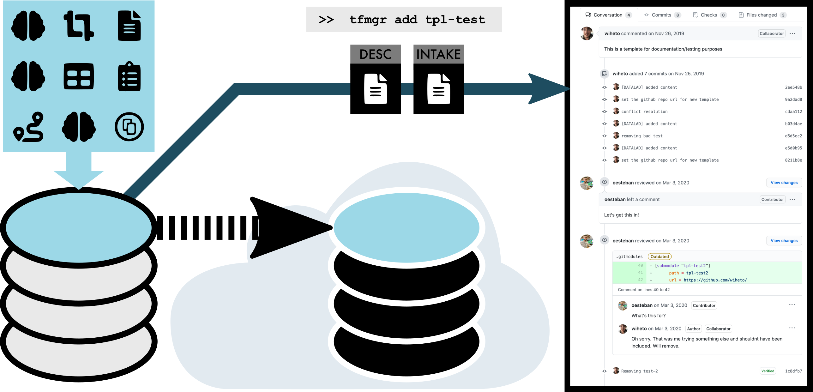

!!! info "Who is this tutorial for?"

	First, this is intended for those wishing to add templates to TemplateFlow. Second, this is for people who want to add a template directory that does not already exists. TemplateFlow consists of multiple templates sorted by the space the template is in. This tutorial tells you how to add a new template space.

	If you want to fix, improve or extend an existing template please refer to the _Updating templates_ documentation (work in progress).

	This tutorial assumes you have read and understood the [contributing guidelines](guidelines.md).

## Overview: Submission pipeline and the _TemplateFlow Manager_ tool

|  |
|:--:| 
| To contribute a new template to _TemplateFlow_, members of the community first organise template resources to conform to the BIDS-like _TemplateFlow_ structure. Next, the _TemplateFlow Manager_ tool (`tfmgr`) synchronises the resources to OSF cloud storage and opens a new pull request proposing the addition of the new template. A subsequent peer-review process ensures that all data are conformant with the _TemplateFlow_ standard. Finally, _TemplateFlow_ curators conclude the peer-review process with the merge of the pull request, thereby adding the template into the _TemplateFlow Archive_. |

## Step 1: Organize your template tree

TemplateFlow follows a BIDS-like structure, please make sure your tree is formatted following the [naming conventions](naming.md).

!!! info "Examples"

    Please check the formatting of existing templates in the [Archive browser](../browse.md)

## Step 2: Create a new public project at osf.io

Head to [your OSF home](https://osf.io/dashboard) and create a new project.
Make sure you **make your project public** and write down the project identifier from the URL.


## Step 3: Install the TemplateFlow Manager and `tfmgr add` your template

Installing the manager is as easy as:

```Shell
pip install git+https://github.com/templateflow/python-manager@master
```

Once the manager is installed, you should be able to print out its version:

```Shell
$ tfmgr --version
TF Archive manager 20.0.0
```

Finally, set up your OSF and GitHub authorization details and call `add`.
It is fundamental to copy here the OSF project ID from step 2.

```Shell
$ export OSF_USERNAME='some@email.com'
$ export OSF_PASSWORD='****'
$ export GITHUB_USER='oesteban'
$ export GITHUB_PASSWORD='****'  # or personal access token

# Assuming the template is at the current directory, under tpl-Name/
$ tfmgr add tpl-Name --osf-project '<project_id>'
```

## Wrapping up

This screencast summarizes the three-step process above:

<script id="asciicast-331256" src="https://asciinema.org/a/331256.js" async data-autoplay="true" data-speed="4" data-theme="tango"></script>
