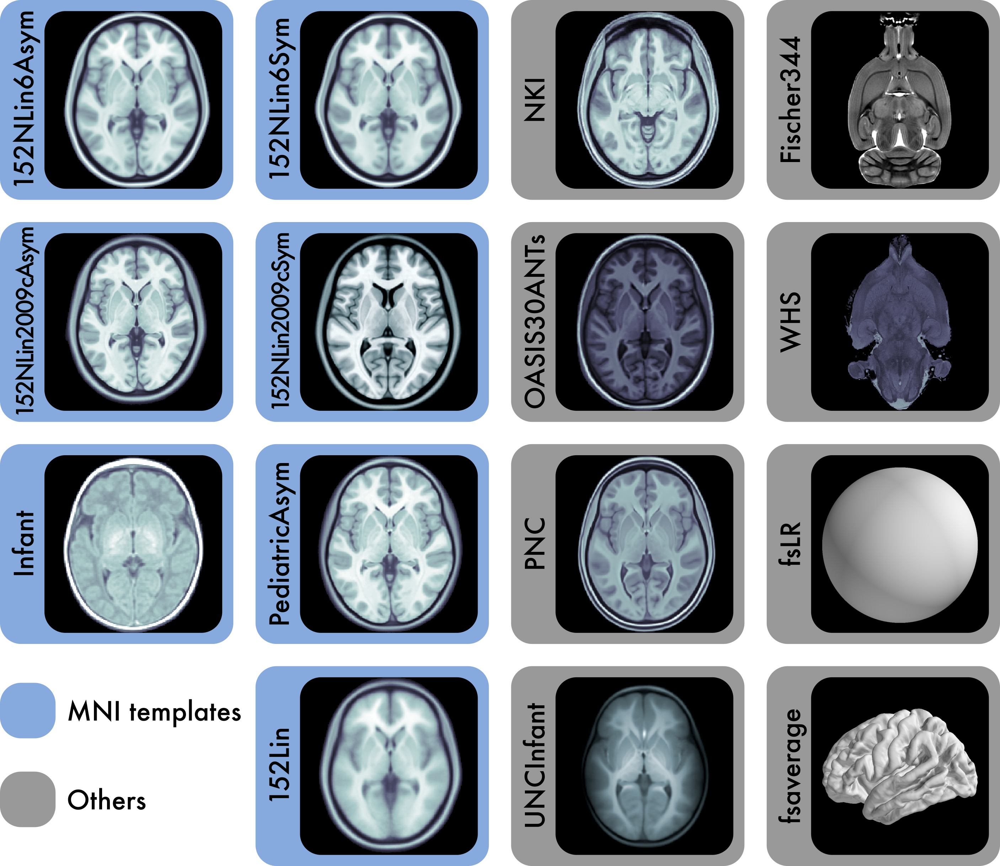
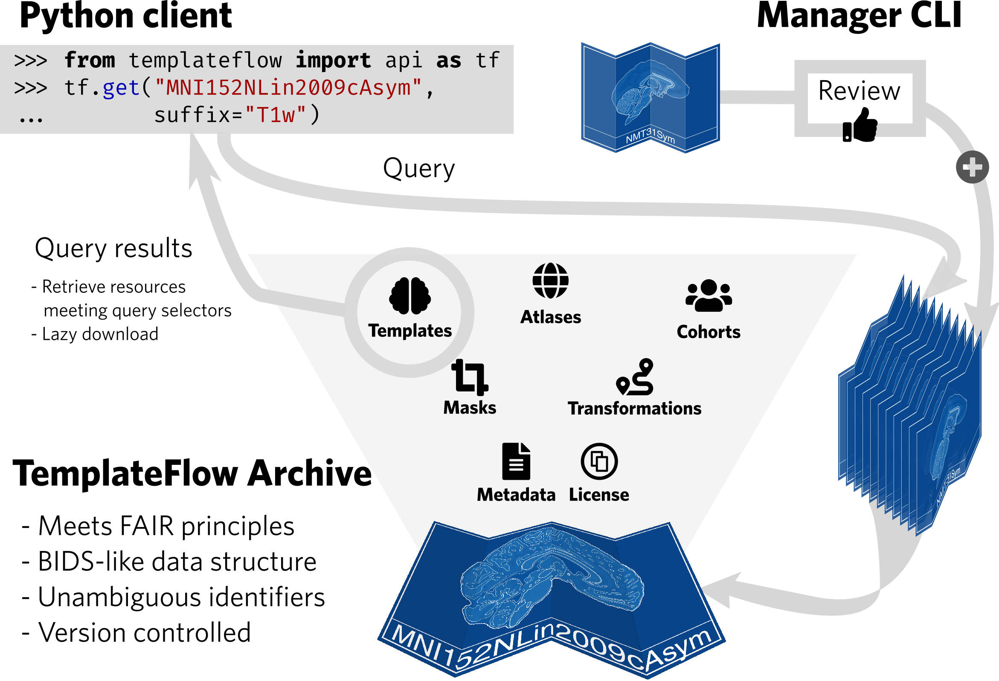

Group inference and reporting of neuroimaging studies require that individual's features are spatially aligned into a common frame where their location can be called standard ([Brett et al., 2002][1]).
To that end, a multiplicity of brain templates with anatomical annotations (i.e. atlases) have been published ([Dickie et al., 2017][2]).
However, a centralized resource that allows programmatic access to templates is lacking.
_TemplateFlow_ is a modular, version-controlled resource that allows researchers to use templates "off-the-shelf" and share new ones.

|  |
|:--:| 
| The 7 templates highlighted in blue are constituents of the Montreal Neurological Institute (MNI) portfolio. The Waxholm space (`WHS`) and `Fischer344` templates provide references for rat neuroimaging. `fsaverage` and `fsLR` are surface templates; the remaining templates are volumetric. Each template is distributed with atlas labels, segmentations, and metadata files. The 15 templates displayed here are only a small fraction of those created as stereotaxic references for the neuroimaging community. |

Please head over to our [_TemplateFlow Archive_ browser](browse.md).

## Bird's view over *TemplateFlow*

|  |
|:--:| 
| ***TemplateFlow* implements the FAIR guiding principles.** The *TemplateFlow Archive* can be accessed at a “low” level with DataLad, or at a “high” level with a *Python client*. New resources can be added through the *TemplateFlow Manager* Command Line Interface, which initiates a peer-review process before acceptance in the *Archive*. |

[1]: https://doi.org/10.1038/nrn756 "The problem of functional localization in the human brain."
[2]: https://dx.doi.org/10.3389/fninf.2017.00001 "Whole Brain Magnetic Resonance Image Atlases: A Systematic Review of Existing Atlases and Caveats for Use in Population Imaging"
